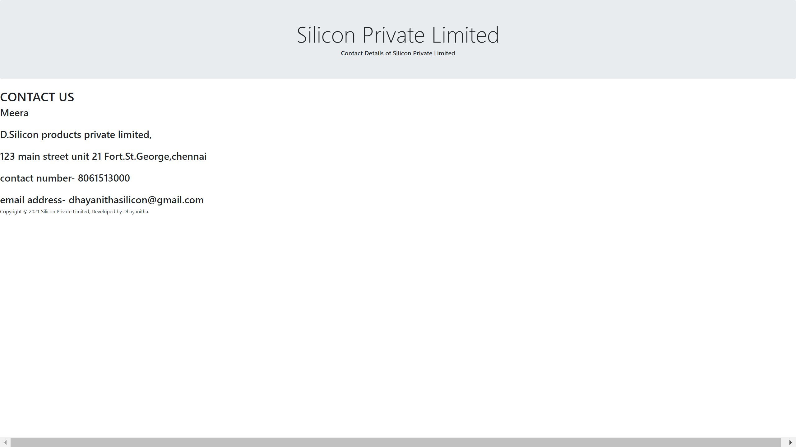
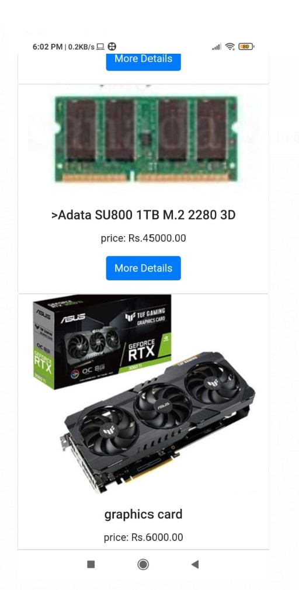
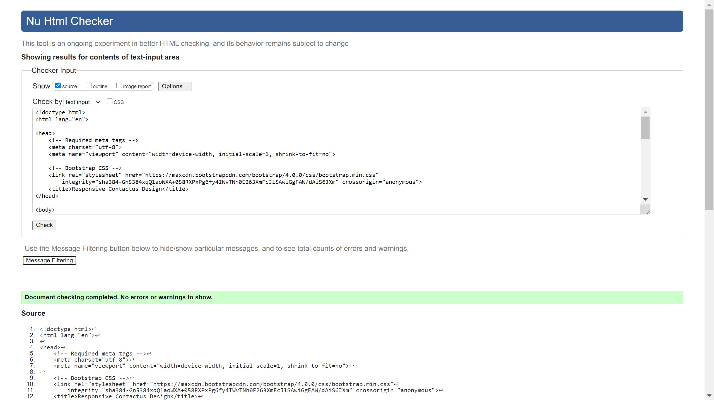
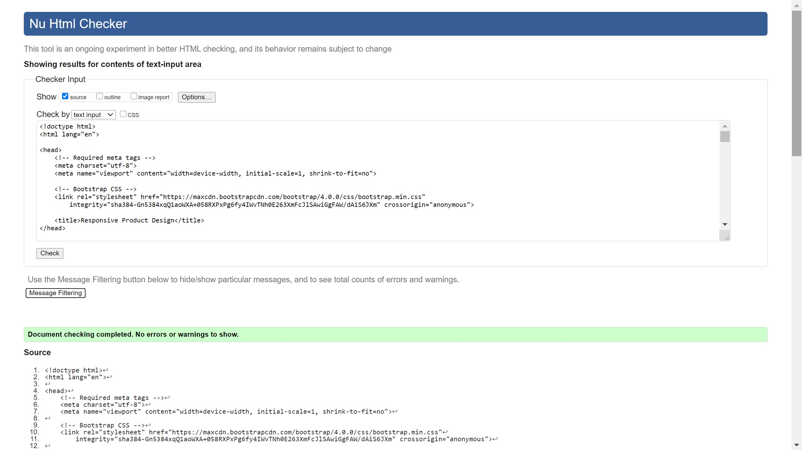

# Design of Responsive Website
## AIM:
To design a responsive website with two break points.

## DESIGN STEPS:
### Step 1: 
Requirement collection.
### Step 2:
Creating the layout using HTML and CSS.
### Step 3:
Updating the sample content.
### Step 4:
Choose the appropriate style and color scheme.
### Step 5:
Validate the layout in various browsers.
### Step 6:
Validate the HTML code.
### Step 7:
Create a database model and migrate the database.
### Step 8:
Retrieve data from database and display it in a dynamic webpage.
### Step 9:
Publish the website in the given URL.

## PROGRAM:
## home html
```
<!doctype html>
<html lang="en">

<head>
    <!-- Required meta tags -->
    <meta charset="utf-8">
    <meta name="viewport" content="width=device-width, initial-scale=1, shrinkto-fit=no">
    <!-- Bootstrap CSS -->
    <link rel="stylesheet" href="https://maxcdn.bootstrapcdn.com/bootstrap/4.0.0/css/bootstrap.min.css"
        integrity="sha384-Gn5384xqQ1aoWXA+058RXPxPg6fy4IWvTNh0E263XmFcJlSAwiGgFAW/dAiS6JXm" crossorigin="anonymous">
    <title>Responsive Aboutus Design</title>
</head>

<body>
    <div class="jumbotron">
        <div class="container text-center">
            <h1 class="display-3">Silicon Private Limited</h1>
            <h5 class="display-6">About Silicon Pvt Ltd</h5>
        </div>
    </div>
    <div class="homecontent">
        <h1>About Us</h1>
        
        <div class="contenttext">
            Silicon Pvt Ltd, provides a broad range of semiconductor and infrastructure
            software applications that serve the data center, networking, software,
            broadband, wireless, and storage and industrial markets. Common applications for
            its products include: data center networking, home connectivity, broadband
            access, telecommunications equipment, smartphones, base stations, data center
            servers and storage, factory automation, power generation and alternative energy
            systems, displays, and mainframe operations and management, and application
            software development. Some of Silicon's core technologies and products include:
            <ul>
                <li>Memory Chips</li>
                <li>SATA HDD</li>
                <li>SATA SSD </li>
                <li>Broadband Modems</li>
                <li>Wifi Devices</li>
                <li>Switching Devices</li>
                <li>Optical Sensors</li>
            </ul>
        </div>
    </div>
    <div class="row">
        <div class="col-12">
            <p>Copyright © 2021 Silicon Private Limited, Developed by Dhayanitha.</p>
        </div>
    </div>
    <!-- Optional JavaScript -->
    <!-- jQuery first, then Popper.js, then Bootstrap JS -->
    <script src="https://code.jquery.com/jquery-3.2.1.slim.min.js"
        integrity="sha384-KJ3o2DKtIkvYIK3UENzmM7KCkRr/rE9/Qpg6aAZGJwFDMVNA/GpGFF93hXpG5KkN"
        crossorigin="anonymous"></script>
    <script src="https://cdnjs.cloudflare.com/ajax/libs/popper.js/1.12.9/umd/popper.min.js"
        integrity="sha384-ApNbgh9B+Y1QKtv3Rn7W3mgPxhU9K/ScQsAP7hUibX39j7fakFPskvXusvfa0b4Q"
        crossorigin="anonymous"></script>
    <script src="https://maxcdn.bootstrapcdn.com/bootstrap/4.0.0/js/bootstrap.min.js"
        integrity="sha384-JZR6Spejh4U02d8jOt6vLEHfe/JQGiRRSQQxSfFWpi1MquVdAyjUar5+76PVCmYl"
        crossorigin="anonymous"></script>
</body>

</html>
```
## people html
```
<!doctype html>
<html lang="en">

<head>
    <!-- Required meta tags -->
    <meta charset="utf-8">
    <meta name="viewport" content="width=device-width, initial-scale=1, shrink-to-fit=no">

    <!-- Bootstrap CSS -->
    <link rel="stylesheet" href="https://maxcdn.bootstrapcdn.com/bootstrap/4.0.0/css/bootstrap.min.css"
        integrity="sha384-Gn5384xqQ1aoWXA+058RXPxPg6fy4IWvTNh0E263XmFcJlSAwiGgFAW/dAiS6JXm" crossorigin="anonymous">

    <title>Responsive People Design</title>
</head>

<body>
    <div class="jumbotron">
        <div class="container text-center">
            <h1 class="display-3">Silicon Private Limited</h1>
            <h5 class="display-6">crew people</h5>
        </div>
    </div>
    <div class="row text-center">
        <div class="col-12">
            <h5 class="display-6">Our Crew People</h5>
        </div>
    </div>
    <div class="row text-center">
        <div class="card col-12 col-md-6 col-lg-3">
            
            <div class="card-body">
                <h5 class="card-title">Tyson Tuttle</h5>
                <p class="card-text">CEO of Silicon labs</p>
                <a href="#" class="btn btn-primary">More Details</a>
            </div>
        </div>
        <div class="card col-12 col-md-6 col-lg-3">
            
            <div class="card-body">
                <h5 class="card-title">Neelima Karalgikar</h5>
                <p class="card-text">Chairman of the Silicon labs</p>
                <a href="#" class="btn btn-primary">More Details</a>
            </div>
        </div>
        <div class="card col-12 col-md-6 col-lg-3">
            
            <div class="card-body">
                <h5 class="card-title">Nav Sooch</h5>
                <p class="card-text">Cheif manager of the Silicon labs </p>
                <a href="#" class="btn btn-primary">More Details</a>
            </div>
        </div>
    </div>
    <div class="row">
        <div class="col-12">
            <p>Copyright © 2021 Silicon Private Limited, Developed by Dhayanitha.</p>
        </div>
    </div>
    <!-- Optional JavaScript -->
    <!-- jQuery first, then Popper.js, then Bootstrap JS -->
    <script src="https://code.jquery.com/jquery-3.2.1.slim.min.js"
        integrity="sha384-KJ3o2DKtIkvYIK3UENzmM7KCkRr/rE9/Qpg6aAZGJwFDMVNA/GpGFF93hXpG5KkN"
        crossorigin="anonymous"></script>
    <script src="https://cdnjs.cloudflare.com/ajax/libs/popper.js/1.12.9/umd/popper.min.js"
        integrity="sha384-ApNbgh9B+Y1QKtv3Rn7W3mgPxhU9K/ScQsAP7hUibX39j7fakFPskvXusvfa0b4Q"
        crossorigin="anonymous"></script>
    <script src="https://maxcdn.bootstrapcdn.com/bootstrap/4.0.0/js/bootstrap.min.js"
        integrity="sha384-JZR6Spejh4U02d8jOt6vLEHfe/JQGiRRSQQxSfFWpi1MquVdAyjUar5+76PVCmYl"
        crossorigin="anonymous"></script>
</body>

</html>
```
## product html
```
<!doctype html>
<html lang="en">

<head>
    <!-- Required meta tags -->
    <meta charset="utf-8">
    <meta name="viewport" content="width=device-width, initial-scale=1, shrink-to-fit=no">

    <!-- Bootstrap CSS -->
    <link rel="stylesheet" href="https://maxcdn.bootstrapcdn.com/bootstrap/4.0.0/css/bootstrap.min.css"
        integrity="sha384-Gn5384xqQ1aoWXA+058RXPxPg6fy4IWvTNh0E263XmFcJlSAwiGgFAW/dAiS6JXm" crossorigin="anonymous">

    <title>Responsive Product Design</title>
</head>

<body>
    <div class="jumbotron">
        <div class="container text-center">
            <h1 class="display-3">Silicon Private Limited</h1>
            <h5 class="display-6">We Manufacture high quality electronic products</h5>
        </div>
    </div>
    <div class="container">
        <div class="row text-center">
            <div class="col-12 col-md-3 "><a href="/home">home</a></div>
            <div class="col-12 col-md-3 "><a href="/productsresponsive">productsresponsive</a></div>
            <div class="col-12 col-md-3 "><a href="/peopleresponsive">peopleresponsive</a></div>
            <div class="col-12 col-md-3 "><a href="/contactus">contactus</a></div>
        </div>
        <div class="row text-center">
            <div class="col-12">
                <h5 class="display-6">Our Premium Products</h5>
            </div>
        </div>
        <div class="row text-center">
            <div class="card col-12 col-md-6 col-lg-3">
                
                <div class="card-body">
                    <h5 class="card-title">broad band modems</h5>
                    <p class="card-text">price: Rs.2000.00</p>
                    <a href="#" class="btn btn-primary">More Details</a>
                </div>
            </div>
            <div class="card col-12 col-md-6 col-lg-3">
                
                <div class="card-body">
                    <h5 class="card-title">cabinet</h5>
                    <p class="card-text">price: Rs.2500.00</p>
                    <a href="#" class="btn btn-primary">More Details</a>
                </div>
            </div>
            <div class="card col-12 col-md-6 col-lg-3">
                
                <div class="card-body">
                    <h5 class="card-title">>Adata SU800 1TB M.2 2280 3D</h5>
                    <p class="card-text">price: Rs.45000.00</p>
                    <a href="#" class="btn btn-primary">More Details</a>
                </div>
            </div>
            <div class="card col-12 col-md-6 col-lg-3">
                
                <div class="card-body">
                    <h5 class="card-title">graphics card</h5>
                    <p class="card-text">price: Rs.6000.00</p>
                    <a href="#" class="btn btn-primary">More Details</a>
                </div>
            </div>
            <div class="card col-12 col-md-6 col-lg-3">
                
                <div class="card-body">
                    <h5 class="card-title">keyboard</h5>
                    <p class="card-text">price: Rs.2000.00</p>
                    <a href="#" class="btn btn-primary">More Details</a>
                </div>
            </div>
            <div class="card col-12 col-md-6 col-lg-3">
                
                <div class="card-body">
                    <h5 class="card-title">memory chips</h5>
                    <p class="card-text">price: Rs.1000.00</p>
                    <a href="#" class="btn btn-primary">More Details</a>
                </div>
            </div>
            <div class="card col-12 col-md-6 col-lg-3">
                
                <div class="card-body">
                    <h5 class="card-title">mouse </h5>
                    <p class="card-text">price: Rs.800.00</p>
                    <a href="#" class="btn btn-primary">More Details</a>
                </div>
            </div>
            <div class="card col-12 col-md-6 col-lg-3">
                
                <div class="card-body">
                    <h5 class="card-title">RYZEN 7 3700X</h5>
                    <p class="card-text">price: Rs.10000.00</p>
                    <a href="#" class="btn btn-primary">More Details</a>
                </div>
            </div>
        </div>
        <div class="row">
            <div class="col-12">
                <p>Copyright © 2021 Silicon Private Limited, Developed by Dhayanitha.</p>
            </div>
        </div>
    </div>
```
## contactus html
```
<!doctype html>
<html lang="en">

<head>
    <!-- Required meta tags -->
    <meta charset="utf-8">
    <meta name="viewport" content="width=device-width, initial-scale=1, shrink-to-fit=no">

    <!-- Bootstrap CSS -->
    <link rel="stylesheet" href="https://maxcdn.bootstrapcdn.com/bootstrap/4.0.0/css/bootstrap.min.css"
        integrity="sha384-Gn5384xqQ1aoWXA+058RXPxPg6fy4IWvTNh0E263XmFcJlSAwiGgFAW/dAiS6JXm" crossorigin="anonymous">
    <title>Responsive Contactus Design</title>
</head>

<body>
    <div class="jumbotron">
        <div class="container text-center">
            <h1 class="display-3">Silicon Private Limited</h1>
            <h5 class="display-6">Contact Details of Silicon Private Limited</h5>
        </div>
    </div>

    <div class="contactuscontent">
        <h1>CONTACT US</h1>
        <div class="contactustext">
            <h2>Meera</h2><br>
            <h2>D.Silicon products private limited,</h2><br>
            <h2>123 main street unit 21 Fort.St.George,chennai</h2><br>
            <h2>contact number- 8061513000</h2><br>
            <h2>email address- dhayanithasilicon@gmail.com</h2>
        </div>
        <div class="row">
            <div class="col-12">
                <p>Copyright © 2021 Silicon Private Limited, Developed by Dhayanitha.</p>
            </div>
        </div>
    </div>


    <!-- Optional JavaScript -->
    <!-- jQuery first, then Popper.js, then Bootstrap JS -->
    <script src="https://code.jquery.com/jquery-3.2.1.slim.min.js"
        integrity="sha384-KJ3o2DKtIkvYIK3UENzmM7KCkRr/rE9/Qpg6aAZGJwFDMVNA/GpGFF93hXpG5KkN"
        crossorigin="anonymous"></script>
    <script src="https://cdnjs.cloudflare.com/ajax/libs/popper.js/1.12.9/umd/popper.min.js"
        integrity="sha384-ApNbgh9B+Y1QKtv3Rn7W3mgPxhU9K/ScQsAP7hUibX39j7fakFPskvXusvfa0b4Q"
        crossorigin="anonymous"></script>
    <script src="https://maxcdn.bootstrapcdn.com/bootstrap/4.0.0/js/bootstrap.min.js"
        integrity="sha384-JZR6Spejh4U02d8jOt6vLEHfe/JQGiRRSQQxSfFWpi1MquVdAyjUar5+76PVCmYl"
        crossorigin="anonymous"></script>

</body>

</html>
```
## OUTPUT:
## for pc




## for mobiles





## CODE VALIDATION REPORT:






## RESULT:
Thus a website is designed for the chip manufacturing company and is hosted in the URL http://dhayanitha.student.saveetha.in:8000/productsresponsive. HTML code is validated.